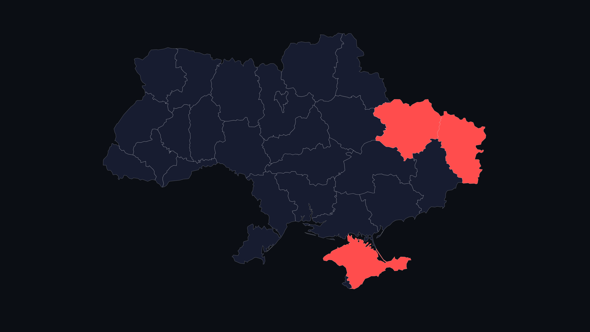

# AlertScreensaver 🇺🇦

Інтерактивна заставка (Screensaver) для Windows, яка відображає карту повітряних тривог України в реальному часі.



## Особливості
- **Дані в реальному часі:** Використовує API `alerts.in.ua` та `api.ukrainealarm.com`.
- **Повноекранний режим:** Працює як стандартна заставка Windows (`.scr`).
- **Гнучкі налаштування:** Зручне вікно для введення API-ключів.
- **Безпека:** Ключі зберігаються локально на вашому ПК.
- **Керування:** Вихід із заставки натисканням клавіші `ESC`.

## Як встановити
1. Завантажте останню збірку з розділу [Releases](https://github.com/sanyarud/AlertScreensaver/releases).
2. Розпакуйте архів у зручне місце (наприклад, `C:\Program Files\AlertScreensaver`).
3. Натисніть правою кнопкою миші на файл `AlertUAScreensaver.scr` та виберіть **"Встановити" (Install)**.
4. У вікні налаштувань заставки натисніть **"Налаштувати" (Settings)**, щоб ввести свої API-ключі.

## Технології
- **Electron** — для роботи як настільний додаток Windows.
- **React + Vite** — для швидкого та сучасного інтерфейсу.
- **react-simple-maps** — для відображення інтерактивної карти.
- **C# Wrapper** — для надійної інтеграції в системні механізми заставок Windows.

## Розробка
```bash
npm install
npm run dev # запуск у режимі розробки
npm run build # збірка проекту
```

---
🇺🇦 Слава Україні!
